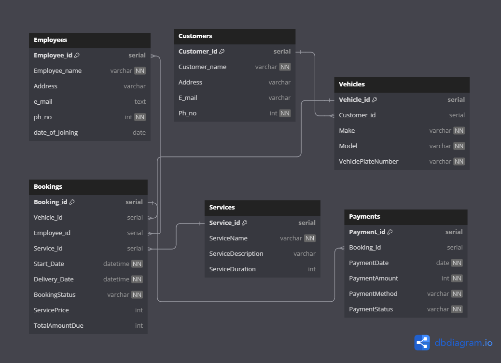

# Garage Manager using JPA SpringBoot-Restful

Developing a Backend Restful microservics for a Garage Client.  
key features of the main software are using - Accounting, Billing & Invoicing, Customer Database, Inventory Control, Service History, Payment Options, Tools (SMS, Alerts, Mails)

## API Reference

#### Use Swagger-UI and existing H2 Local DB for Local Testing APIs.

## Database

## Roadmap

- Integrating to Front-end React Website & React-Native Android/IOS

- Add more integrations

